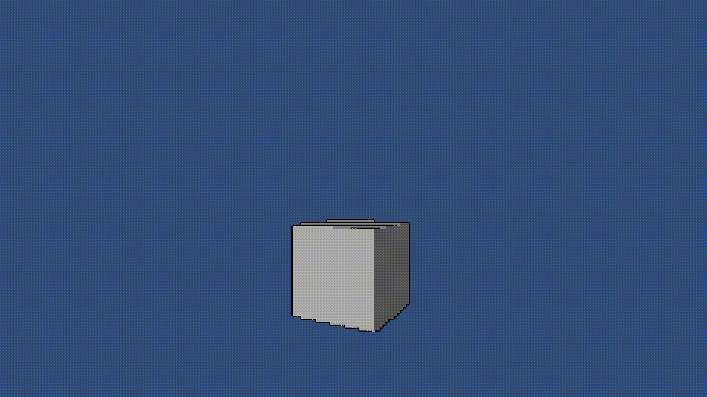

# Unity-Animation-Framework

## Description
Unity-Animation-Framework is a set of Unity monobehaviour and c# scripts used to render and create animations.

The framework provides a structure and basic scripts required inorder to make animations in unity.

